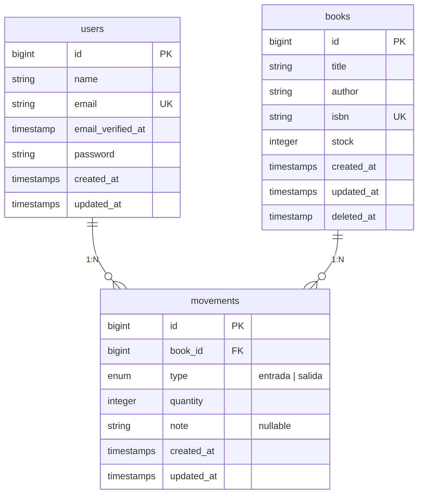
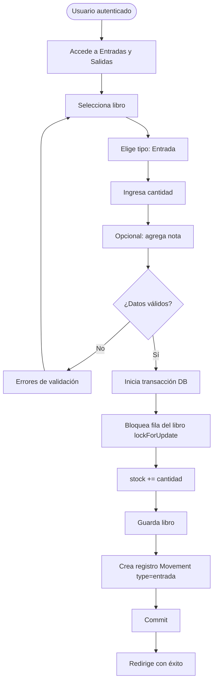
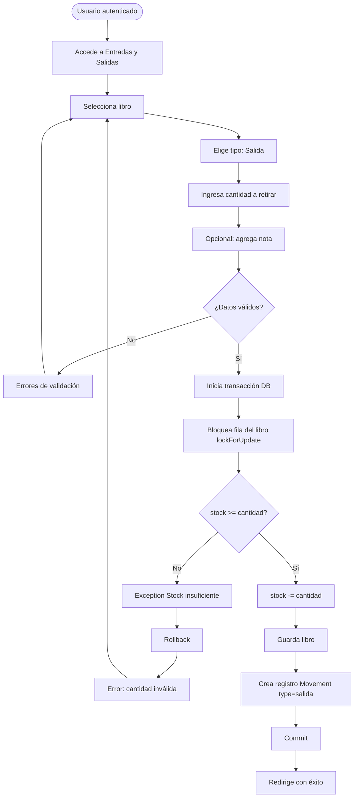
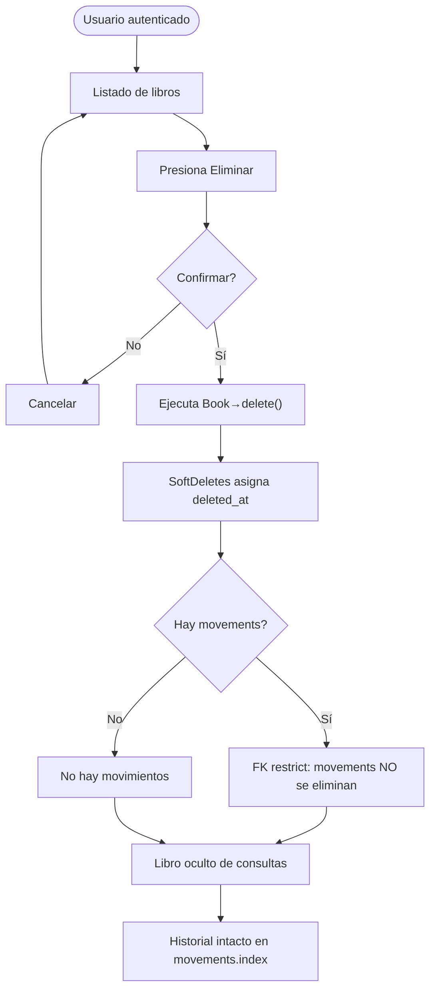

# 📚 BibliotecaHub - Sistema de Control de Existencias (Inventario)

BibliotecaHub es un sistema web premium diseñado en Laravel para facilitar la gestión del catálogo de libros y el control preciso de existencias mediante transacciones seguras de entradas y salidas de inventario.

---

## 🛠️ Requisitos Previos

Antes de comenzar, asegúrate de tener instalado en tu equipo:
- **PHP** (versión 8.1 o superior)
- **Composer** (gestor de dependencias de PHP)
- **Node.js y npm** (para compilar assets frontend)
- **Git** (opcional, para control de versiones)

---

## 🚀 Guía de Instalación (Con base de datos local SQLite)

Sigue estos pasos en tu terminal (PowerShell o CMD) para levantar el proyecto desde cero:

### 1. Clonar el repositorio
```bash
git clone https://github.com/EquipoUneti/ProgII_Biblioteca.git
cd ProgII_Biblioteca
```

### 2. Descargar Dependencias de PHP
```bash
composer install
```

### 3. Configurar el archivo de entorno
```bash
cp .env.example .env
```

### 4. Configurar la Base de Datos SQLite
```powershell
New-Item -Path "database\database.sqlite" -ItemType File -Force
```
*El archivo `.env` ya viene configurado con `DB_CONNECTION=sqlite` por defecto.*

### 5. Generar la Clave de Seguridad
```bash
php artisan key:generate
```

### 6. Ejecutar Migraciones
```bash
php artisan migrate
```

### 7. Instalar y compilar assets frontend (Laravel Breeze)
```bash
php artisan breeze:install blade
npm install && npm run build
```

### 8. Crear un usuario administrador
```bash
php artisan tinker
```
```php
\User::create(['name' => 'Admin', 'email' => 'admin@biblioteca.com', 'password' => bcrypt('admin123')]);
```
> Presiona `Ctrl+C` para salir de tinker.

---

## 💻 Ejecución del Sistema

1. Inicia el servidor:
   ```bash
   php artisan serve
   ```
2. Abre en tu navegador: **[http://127.0.0.1:8000](http://127.0.0.1:8000)**
3. Inicia sesión con el usuario creado.

---

## 📖 Funcionalidades Principales

### 🔐 Autenticación de Usuarios
- Login y registro de usuarios mediante **Laravel Breeze** con Blade.
- Las rutas operativas (`books`, `movements`, `profile`) están protegidas tras autenticación.
- Redirección automática al login si no hay sesión activa.

### 📚 Gestión de Libros (Catálogo)
- CRUD completo con validación única de código ISBN.
- **Buscador multicriterio** por título, autor o ISBN con paginación (10 registros por página).
- **Eliminación lógica (SoftDeletes)**: los libros eliminados conservan su historial de movimientos intacto.

### 🔄 Entradas y Salidas de Stock
- Registro de entradas (incrementa el stock) y salidas (disminuye el stock).
- **Validación de stock disponible**: no permite registrar una salida si el stock es insuficiente.
- **Consistencia transaccional**: usa transacciones de base de datos (`DB::transaction()`) combinadas con bloqueos de fila (`lockForUpdate()`) para evitar condiciones de carrera.
- **Preservación del historial**: la clave foránea `book_id` usa `onDelete('restrict')`, impidiendo la eliminación física de un libro con movimientos asociados.

### 🧑 Perfil de Usuario
- Edición de perfil, cambio de contraseña y eliminación de cuenta (proporcionado por Breeze).

---

## 🗂️ Modelo de Datos

### Entidades

| Entidad     | Columnas principales                                                              |
|-------------|-----------------------------------------------------------------------------------|
| `users`     | id, name, email, password, timestamps                                             |
| `books`     | id, title, author, isbn (unique), stock, timestamps, deleted_at (soft delete)     |
| `movements` | id, book_id (FK), type (entrada/salida), quantity, note, timestamps               |

### Relaciones
- `users` **1:N** `movements` (opcional)
- `books` **1:N** `movements`

### Diagrama Entidad-Relación



---

## 📊 Diagramas de Proceso (UML)

### Actividad — Registro de entrada de stock



### Actividad — Registro de salida con validación de stock



### Actividad — Eliminación lógica (SoftDelete) preservando historial


