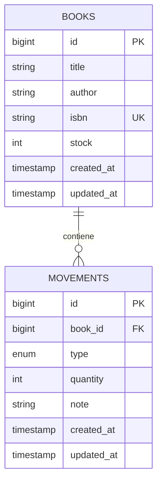

# INFORME TÉCNICO Y ACADÉMICO: SISTEMA DE GESTIÓN DE EXISTENCIAS BIBLIOTECARIAS (BIBLIOTECAHUB)

**Asignatura / Proyecto:** Desarrollo y Arquitectura de Sistemas de Información  
**Modulo:** Punto 4: Entrada, Salida y Existencia de Libros  
**Autor:** Desarrollador Senior en Laravel & Arquitecto de Software  
**Destinatario / Cliente:** Bibliotecólogo de la Institución  
**Fecha:** Julio 2026  

---

## 1. INTRODUCCIÓN Y ALCANCE DEL SISTEMA

### 1.1 Introducción
La trazabilidad en la administración de recursos físicos es un reto crítico para los bibliotecólogos. La falta de automatización en el control de existencias puede dar lugar a incoherencias tales como préstamos de libros inexistentes, pérdida de inventario físico y discrepancias administrativas. El presente sistema, **BibliotecaHub**, provee una solución robusta y simplificada desarrollada bajo el framework Laravel (PHP), implementando patrones de arquitectura de software seguros como el aislamiento de transacciones de bases de datos para garantizar la integridad y coherencia en tiempo real.

### 1.2 Alcance del Sistema
El sistema cubre las siguientes necesidades operativas del bibliotecólogo:
- **Gestión de Catálogo (CRUD de Libros):** Registro de nuevos títulos, asignación de código único normalizado (ISBN), edición de metadatos (Título y Autor) y eliminación del registro.
- **Control de Inventario (Entradas/Salidas):** Registro histórico y detallado de cada flujo de material en el almacén.
- **Consistencia Transaccional:** Incremento automático del stock al registrar una entrada y validación estricta de stock suficiente antes de autorizar cualquier salida física de material, garantizando que el stock nunca sea inferior a cero (0).
- **Historial de Auditoría:** Lista completa y cronológica de todos los movimientos de entrada y salida con fecha, cantidad y notas descriptivas asociadas.

---

## 2. MODELADO DE CASOS DE USO

El único actor del sistema es el **Bibliotecólogo**, quien posee control total sobre el catálogo de libros y el registro de movimientos del almacén.

### 2.1 Diagrama de Casos de Uso (Sintaxis Mermaid.js)

```mermaid
useCaseDiagram
    rect rgba(30, 58, 138, 0.05)
        actor Bibliotecólogo
        usecase CU01 as "CU01: Registrar Libro"
        usecase CU02 as "CU02: Modificar Libro"
        usecase CU03 as "CU03: Registrar Entrada (Stock)"
        usecase CU04 as "CU04: Registrar Salida (Stock)"
    end
    Bibliotecólogo --> CU01
    Bibliotecólogo --> CU02
    Bibliotecólogo --> CU03
    Bibliotecólogo --> CU04
```

### 2.2 Especificación Formal de Casos de Uso

| **Caso de Uso** | **CU01: Registrar Libro** |
| :--- | :--- |
| **Actor Principal** | Bibliotecólogo |
| **Descripción** | Permite agregar un nuevo libro al catálogo general de la biblioteca. |
| **Precondiciones** | El bibliotecólogo debe tener acceso a la interfaz de administración. |
| **Flujo Principal** | 1. El actor presiona el botón "Registrar Nuevo Libro".<br>2. El sistema muestra el formulario de registro.<br>3. El actor ingresa el Título, Autor e ISBN del libro.<br>4. El actor presiona "Guardar Libro".<br>5. El sistema valida los datos (el ISBN debe ser único en la BD).<br>6. El sistema crea el registro con un stock inicial igual a 0.<br>7. El sistema redirige al listado principal con un mensaje de éxito. |
| **Flujos Alternos** | **5a. ISBN Duplicado o Faltante:** El sistema muestra una alerta de error de validación en el formulario y no guarda los cambios. |
| **Postcondiciones** | El nuevo libro se almacena de forma persistente en la base de datos con stock cero. |

<br>

| **Caso de Uso** | **CU02: Modificar Libro** |
| :--- | :--- |
| **Actor Principal** | Bibliotecólogo |
| **Descripción** | Permite modificar los metadatos (Título, Autor, ISBN) de un libro existente en el catálogo. |
| **Precondiciones** | El libro ya debe estar registrado en la base de datos. |
| **Flujo Principal** | 1. El actor selecciona la opción "Editar" en el libro correspondiente en el listado.<br>2. El sistema precarga los campos en el formulario.<br>3. El actor modifica el Título, Autor o ISBN del libro.<br>4. El actor presiona "Actualizar Libro".<br>5. El sistema valida la información (el ISBN no debe pertenecer a otro libro).<br>6. El sistema guarda las modificaciones en la base de datos.<br>7. El sistema redirige al listado de libros con un mensaje de éxito. |
| **Flujos Alternos** | **5a. Validación fallida:** El sistema retorna al formulario resaltando los errores (por ejemplo, campo vacío o ISBN duplicado). |
| **Postcondiciones** | Los datos del libro son actualizados. El stock no sufre alteraciones. |

<br>

| **Caso de Uso** | **CU03: Registrar Entrada (Stock)** |
| :--- | :--- |
| **Actor Principal** | Bibliotecólogo |
| **Descripción** | Permite registrar un ingreso de ejemplares físicos al almacén para incrementar el stock de un libro específico. |
| **Precondiciones** | El libro debe estar registrado previamente. |
| **Flujo Principal** | 1. El actor accede al módulo "Entradas y Salidas".<br>2. El actor selecciona el libro del listado desplegable.<br>3. El actor selecciona el tipo "Entrada".<br>4. El actor ingresa la cantidad a incorporar (entero positivo) y una nota opcional.<br>5. El actor presiona "Aplicar Transacción".<br>6. El sistema abre una transacción de BD (`DB::transaction`).<br>7. El sistema bloquea la fila del libro para lectura/escritura (`lockForUpdate`).<br>8. El sistema adiciona la cantidad al stock del libro.<br>9. El sistema crea un registro en la tabla de movimientos.<br>10. El sistema confirma la transacción (Commit) e informa el éxito al usuario. |
| **Flujos Alternos** | **5a. Cantidad Inválida:** Si la cantidad es menor a 1 o no es un entero, el sistema interrumpe el flujo y reporta el error. |
| **Postcondiciones** | El stock actual del libro incrementa en la cantidad registrada y se añade un registro de entrada al historial. |

<br>

| **Caso de Uso** | **CU04: Registrar Salida (Stock)** |
| :--- | :--- |
| **Actor Principal** | Bibliotecólogo |
| **Descripción** | Permite registrar la salida o retiro de ejemplares del inventario reduciendo su existencia en almacén. |
| **Precondiciones** | El libro debe estar registrado previamente. |
| **Flujo Principal** | 1. El actor accede al módulo "Entradas y Salidas".<br>2. El actor selecciona el libro correspondiente.<br>3. El actor selecciona el tipo "Salida".<br>4. El actor ingresa la cantidad a retirar y una nota opcional.<br>5. El actor presiona "Aplicar Transacción".<br>6. El sistema abre una transacción de BD (`DB::transaction`).<br>7. El sistema bloquea la fila del libro (`lockForUpdate`) y lee el stock actual.<br>8. El sistema valida si el `stock >= cantidad_solicitada`. <br>9. Al cumplirse, el sistema resta la cantidad al stock del libro.<br>10. El sistema crea un registro en la tabla de movimientos.<br>11. El sistema confirma la transacción (Commit) y muestra un mensaje de éxito. |
| **Flujos Alternos** | **8a. Stock Insuficiente:** Si el stock disponible es menor a la cantidad solicitada, el sistema genera una excepción, cancela la transacción completa (Rollback), devuelve los datos ingresados al formulario y muestra un error indicando que no hay stock suficiente. |
| **Postcondiciones** | Las existencias del libro disminuyen de forma coherente y se añade un registro de salida al historial. |

---

## 3. DISEÑO DE BASE DE DATOS Y ARQUITECTURA

### 3.1 Diagrama Entidad-Relación (Sintaxis Mermaid.js)



### 3.2 Diccionario de Datos

#### Tabla: `books`
Representa el catálogo físico de libros y su stock actual consolidado.

| Nombre de Campo | Tipo de Dato | Nulabilidad | Clave | Descripción |
| :--- | :--- | :--- | :--- | :--- |
| **id** | BIGINT UNSIGNED | No Nulo | PK | Identificador numérico único autoincremental de la tabla. |
| **title** | VARCHAR(255) | No Nulo | - | Título principal de la obra literaria. |
| **author** | VARCHAR(255) | No Nulo | - | Nombre completo del autor del libro. |
| **isbn** | VARCHAR(20) | No Nulo | UK | Código internacional normalizado (ISBN), único en el sistema. |
| **stock** | INT | No Nulo | - | Cantidad actual de existencias del libro en inventario (Por defecto: 0). |
| **created_at** | TIMESTAMP | Nulo | - | Marca de tiempo que registra la fecha y hora de creación del registro. |
| **updated_at** | TIMESTAMP | Nulo | - | Marca de tiempo que registra la fecha de la última actualización. |

#### Tabla: `movements`
Almacena el registro histórico e inmutable de las entradas y salidas de stock del inventario.

| Nombre de Campo | Tipo de Dato | Nulabilidad | Clave | Descripción |
| :--- | :--- | :--- | :--- | :--- |
| **id** | BIGINT UNSIGNED | No Nulo | PK | Identificador numérico único autoincremental del movimiento. |
| **book_id** | BIGINT UNSIGNED | No Nulo | FK | Clave foránea que referencia a `books.id`. Elimina en cascada si el libro es borrado. |
| **type** | ENUM('entrada','salida') | No Nulo | - | Clasificación del flujo. 'entrada' (ingreso de stock) o 'salida' (egreso). |
| **quantity** | INT | No Nulo | - | Cantidad de unidades transferidas en el movimiento (Debe ser > 0). |
| **note** | VARCHAR(255) | Nulo | - | Comentarios adicionales del movimiento (ej: "Detección de mermas"). |
| **created_at** | TIMESTAMP | Nulo | - | Marca de tiempo de registro de la transacción (sirve como fecha del movimiento). |
| **updated_at** | TIMESTAMP | Nulo | - | Marca de tiempo de última actualización del movimiento. |

---

## 4. MANUAL DE INSTALACIÓN Y DESPLIEGUE DEL PROYECTO

Sigue estos pasos básicos para levantar el proyecto desde el entorno local:

### Requisitos Previos
- PHP 8.1 o superior instalado.
- Composer instalado en el sistema.
- Motor de base de datos relacional (MariaDB, MySQL, SQLite o PostgreSQL).

### Paso 1: Clonar o crear el directorio de trabajo
Asegúrate de que los archivos estén ubicados en la carpeta raíz del proyecto, en este caso `f:\biblioteca`.

### Paso 2: Instalar Dependencias
Abre una terminal PowerShell o CMD en la carpeta raíz de tu aplicación y ejecuta:
```bash
composer install
```

### Paso 3: Configurar el Archivo de Entorno `.env`
Duplica el archivo de configuración base:
```bash
cp .env.example .env
```
Abre el archivo `.env` en tu editor de código y configura la conexión a la base de datos. Ejemplo para MySQL:
```ini
DB_CONNECTION=mysql
DB_HOST=127.0.0.1
DB_PORT=3306
DB_DATABASE=biblioteca_hub
DB_USERNAME=root
DB_PASSWORD=tu_contraseña
```

### Paso 5: Ejecutar las Migraciones
Este paso creará las tablas `books` y `movements` con sus respectivas restricciones, claves primarias, foráneas y valores por defecto:
```bash
php artisan migrate
```

### Paso 6: Servir la Aplicación Localmente
Levanta el servidor local de desarrollo que incluye Laravel:
```bash
php artisan serve
```
El sistema estará accesible a través de la URL [http://127.0.0.1:8000](http://127.0.0.1:8000) de tu navegador web. Puedes navegar por las pestañas **Control de Libros** y **Entradas y Salidas** para verificar el completo funcionamiento.
